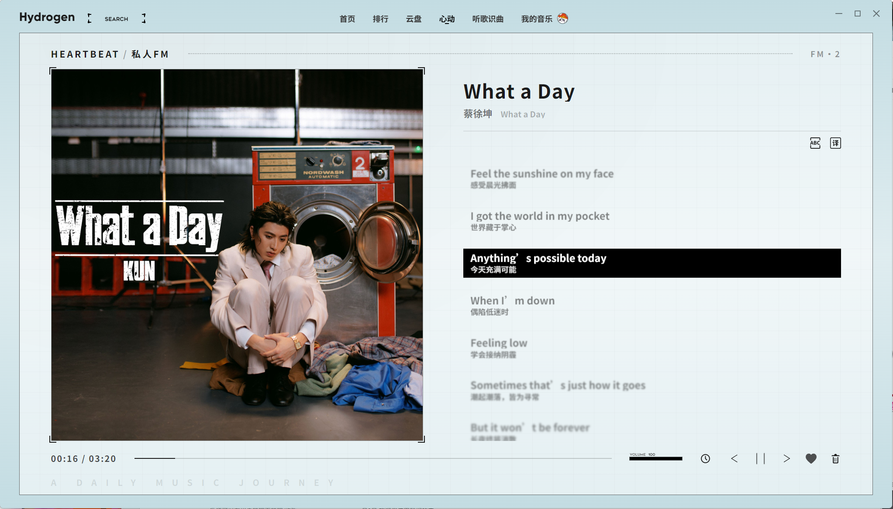
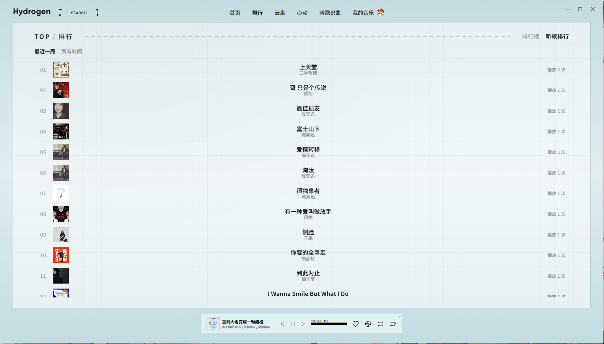
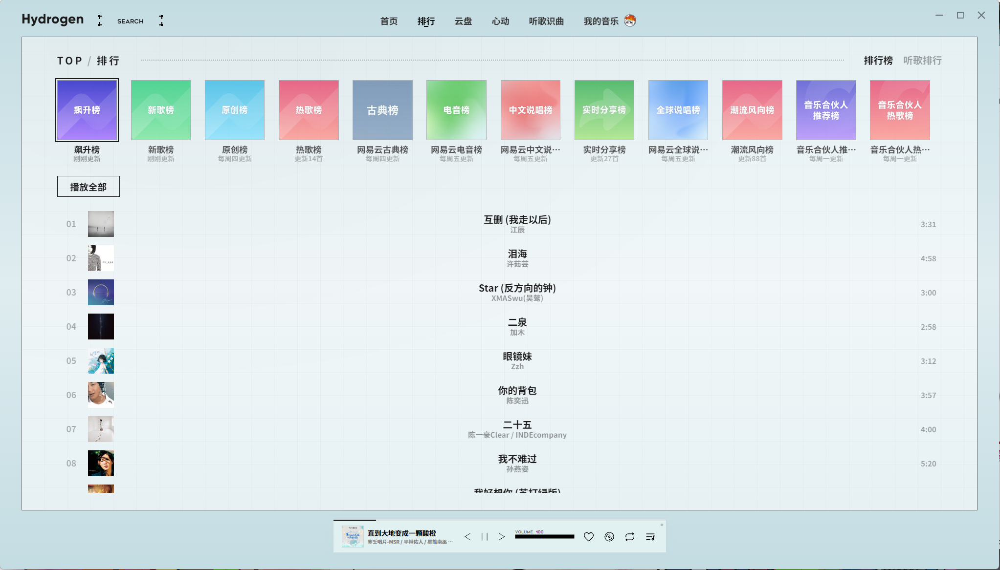

<div align="center">

<p align="center">
  <a href="https://github.com/jinghuashang/Hydrogen-Music" target="_blank">
    
  </a>
</p>

<h1 align="center" style="font-weight: 700; border-bottom: none; margin-top: 16px; margin-bottom: 8px;">Hydrogen Music</h1>

<p align="center">
  <strong>轻盈 · 纯粹 · 全能 —— 现代化高颜值明日方舟工业风格第三方网易云音乐播放器</strong>
</p>


<p align="center">
  <a href="https://github.com/vuejs/core"></a>
  <a href="https://vitejs.dev/"></a>
  <a href="https://www.electronjs.org/"></a>
  <a href="https://pinia.vuejs.org/"></a>
  <a href="https://github.com/jinghuashang/Hydrogen-Music/releases"></a>
  <a href="./LICENSE"></a>
  <a href="https://github.com/jinghuashang/Hydrogen-Music"></a>
</p>

<p align="center">
  <a href="#-特性亮点">✨ 特性亮点</a> •
  <a href="#-界面预览">🖼️ 界面预览</a> •
  <a href="#-双端形态与能力矩阵">📊 双端能力</a> •
  <a href="#-获取与安装">📦 下载安装</a> •
  <a href="#-nas--web-私有化部署">🌐 私有部署</a> •
  <a href="#-开发者指南">🛠️ 开发者指南</a> •
  <a href="#-开源致谢">💖 鸣谢</a>
</p>

</div>

---

> **🌱 致敬与溯源声明**：  
> 本项目源于并致敬上游项目 [Kaidesuyo/Hydrogen-Music](https://github.com/Kaidesuyo/Hydrogen-Music)。在此基础上，本项目持续进行了深度的现代化架构升级、Web/NAS 双模网关重构、UNM 无损音质提权以及全方位 UI/UX 体验打磨。感谢原作者奠定的基石！

## 💡 为什么选择 Hydrogen Music？


不同于传统的客户端套壳与千篇一律的极简播放器，**Hydrogen Music** 深度打通了 **桌面端原生能力** 与 **私有云 Web / NAS 网关** 双模形态。在兼具 **Apple Music** 级精致流体质感的同时，融合 **明日方舟工业风格** 并加入 **多源无损音质提权**、**Bilibili 高清 MV 生态联动**、**WASM 离线声学听歌识曲** 以及 **复古与现代碰撞的 Heartbeat 心动模式**，让每一次聆听都赏心悦目。

---

## ✨ 特性亮点

Hydrogen Music 深度融合了现代视听交互与全栈工程架构，带来以下核心特色功能体验：

### 🎨 轻盈美学 · 沉浸视听
- **流体卡片设计**：现代化 Bento 卡片式布局、半调网点纹理（Halftone）与细腻的毛玻璃光影效果。
- **全屏沉浸歌词**：流畅歌词滚动动效，支持 **双语翻译**、**罗马音/拼音标注**、字体自由切换与时间轴交互。
- **定制精选字体**：内置并支持外部扩展 Source Han Sans、Gilroy、Geometos、Bender 等个性化艺术字体。

### 🎧 多源解锁 · 极致音质
- **内置 UNM 多源调度**：深度集成 UnblockNeteaseMusic，聚合酷我、酷狗、QQ、咪咕、Bilibili、波点等多平台音源。
- **自动音质提权**：智能匹配最高可用码率（`SELECT_MAX_BR`），自动优先获取高规格无损 FLAC / Hi-Res 音质。

### 📻 Heartbeat · 心动调频 (私人 FM)
- **沉浸式画框美学**：极具设计感的相框大封套排版与半调网点背景，开启专属的 *"A Daily Music Journey"* 音乐漫游。
- **全屏视听联动**：高帧率动态歌词滚动，支持一键切换 **双语翻译 (`译`)** 与 **罗马音/拼音注音 (`ABC`)**。
- **贴心交互底栏**：集成高精度时间轴拖拽、独立音量滑块、智能 **睡眠定时器 (`⏱`)**、红心快速收藏 (`❤️`) 与垃圾桶跳过 (`🗑️`)。

### 🏆 独立排行榜单 · 炫彩卡片矩阵
- **聚合全网权威榜单**：深度直连网易云官方 12+ 核心榜单（飙升榜、新歌榜、原创榜、热歌榜、古典榜、电音榜、中文说唱榜、实时分享榜、潮流风向榜、音乐合伙人推荐榜等）。
- **多彩渐变 Bento 卡片**：独特的炫彩渐变悬浮卡片流设计，卡片清晰标注各榜单实时更新周期（如“刚刚更新”、“每周四更新”、“更新88首”）。
- **流畅沉浸交互**：支持一键「播放全部」、双击秒播，搭配平滑淡入淡出 (`tl-fade`) 转场动画。

### 📈 听歌排行 · 个人专属音乐足迹
- **智能偏好追踪**：精准统计用户的单曲循环频次与听歌历史偏好，留住每一次与旋律的共鸣。
- **双时间维度回溯**：支持 **「最近一周」** 与 **「所有时间」** 自由切换，清晰展现每首歌曲的累计播放次数（如“播放 12 次”）。

### 🎬 视听联动 · Bilibili MV 矩阵
- **MV 生态无缝整合**：集成 Bilibili 高清视频解析与播放能力，告别画质模糊。
- **定制多媒体播放器**：基于 Plyr 打造的深度定制视频播放器，享受剧场级视听共鸣。

### 🔍 声学指纹 · WASM 听歌识曲
- **本地 WebAssembly 算法引擎**：搭载高性能 WASM 声学指纹提取算法。
- **实时音频频谱分析**：支持麦克风录音秒级精准识别，轻松找回耳畔掠过的旋律。

### 📁 本地音乐 · 智能媒体库
- **智能递归扫描**：依托 `music-metadata` 与 `node-taglib-sharp`，极速提取本地音频元数据与内嵌封面。
- **任务式下载管理**：支持单曲与批量离线高品质音频文件下载。

### ⚡ 双模架构 · 全端覆盖
- **全平台支持**：提供 Windows（安装版/便携版）、macOS 桌面客户端。
- **Web / NAS 一体化**：自带 Node.js 网关，支持 Docker、Linux systemd 守护进程与 Vercel 部署。

---

## 🖼️ 界面预览

以下为 Hydrogen Music 桌面客户端实际运行界面截图：

<div align="center">

| 首页探索 · 发现音乐 | 沉浸式动态歌词 |
|:---:|:---:|
|  |  |

| Heartbeat · 心动模式 (私人 FM) | 纯享歌词与专辑视效 |
|:---:|:---:|
|  |  |

| 独立排行榜单 · 炫彩卡片矩阵 | 个人听歌排行 · 偏好足迹 |
|:---:|:---:|
|  |  |

| 歌单与媒体库详情 | Bilibili 高清 MV 视频联动 |
|:---:|:---:|
|  |  |

</div>

---

## 📊 双端形态与能力矩阵

Hydrogen Music 支持 **Electron 桌面原生模式** 与 **Web / NAS 自托管网关模式**：

| 功能维度 | 桌面客户端 (Electron) | 私有云网关版 (Web / NAS) | Vercel 静态托管 |
| :--- | :---: | :---: | :---: |
| **网易云核心音乐播放** | ✅ | ✅ | ✅ |
| **账号登录 (扫码 / Cookie / 手机)** | ✅ | ✅ | ✅ |
| **沉浸式歌词 (翻译 / 罗马音)** | ✅ | ✅ | ✅ |
| **Heartbeat 心动模式 (私人 FM)** | ✅ | ✅ | ✅ |
| **独立排行榜单 (12+ 官方权威榜)** | ✅ | ✅ | ✅ |
| **个人听歌排行统计 (周榜 / 总榜)** | ✅ | ✅ | ✅ |
| **Bilibili MV 视频联动播放** | ✅ | ✅ | ✅ |
| **UNM 多源音源解锁** | ✅ (内置自启) | ✅ (网关直连) | ⚠️ (需配置外部后端) |
| **WASM 录音听歌识曲** | ✅ | ✅ | ✅ (需 HTTPS 麦克风权限) |
| **本地音频文件夹扫描** | ✅ (本地磁盘) | ✅ (NAS 服务器磁盘) | ❌ |
| **音频下载管理器** | ✅ (本地保存) | ✅ (存入服务端磁盘) | ❌ |
| **系统托盘 / 全局快捷键** | ✅ | ❌ | ❌ |
| **窗口吸附与状态记忆** | ✅ | ❌ | ❌ |
---

## 📦 获取与安装

本项目为各主流操作系统提供开箱即用的原生桌面客户端及免安装便携版本：

### 💻 桌面客户端 (推荐)

前往 [GitHub Releases](https://github.com/jinghuashang/Hydrogen-Music/releases) 下载最新发行版：

- **Windows**: 下载 `.exe` 安装程序或 `.zip` 便携免安装版。
- **macOS**: 下载 `.dmg` 镜像安装包（支持 Apple Silicon 与 Intel 芯片）。

---

## 🌐 NAS / Web 私有化部署

Hydrogen Music 提供了轻量独立的 Node.js Gateway 服务，非常适合常驻部署于 NAS（群晖 Synology、QNAP、Unraid、TrueNAS）、家庭服务器或 VPS。

### 方式一：Node.js 原生运行

```bash
# 1. 克隆代码仓库并安装依赖
git clone https://github.com/jinghuashang/Hydrogen-Music.git
cd Hydrogen-Music
npm install

# 2. 构建 Web 前端静态资源
npm run web:build

# 3. 启动私有云网关服务 (默认端口: 37890)
npm run web:server
```
启动完成后，在局域网或浏览器中访问 `http://<你的NAS或服务器IP>:37890` 即可开始使用。

### 方式二：systemd 守护进程 (Linux)

参考项目中的 `web/systemd/hydrogen-music-web.service.example`：
1. 修改其中的 `WorkingDirectory`、`ExecStart` 及 `User` 为你的实际路径和用户；
2. 复制到 `/etc/systemd/system/hydrogen-music-web.service`；
3. 执行 `sudo systemctl daemon-reload && sudo systemctl enable --now hydrogen-music-web`。

### 方式三：部署至 Vercel (纯前端体验)

你可以直接将前端一键托管至 Vercel，详细步骤请参阅 [VERCEL_DEPLOYMENT.md](./VERCEL_DEPLOYMENT.md)。

---

## 🛠️ 开发者指南

如果你希望参与 Hydrogen Music 的功能开发、本地调试或打包构建，请参考以下操作指南：

### 环境准备
- Node.js >= 18.0.0
- npm >= 9.0.0

### 本地开发

```bash
# 1. 安装项目所有依赖
npm install

# 2. 启动 Vue 前端热更新服务 (http://localhost:5173)
npm run dev

# 3. 启动 Electron 桌面开发窗口 (在另一终端执行)
npm start
```

### Web 模式本地联调

```bash
# 终端 A: 启动本地网关 (含 NCM API + UNM 代理)
npm run web:server

# 终端 B: 启动 Web 端热更新开发服务器 (http://localhost:5174)
npm run web:dev
```

### 打包构建

```bash
# 构建桌面安装包 (Windows / macOS)
npm run dist

# 构建 Web 端静态分发资源 (生成于 web/dist/)
npm run web:build
```

---

## 📐 技术架构

项目采用清晰的分层解耦架构，桌面端主进程与 Web 网关端共享核心业务逻辑：

```
├── src/                      # 前端核心源码 (Vue 3 + Pinia + Vue Router)
│   ├── api/                  # NCM 及多媒体 API 接口封装
│   ├── components/           # UI 组件库 (歌词、播放组件、视频、弹窗等)
│   ├── views/                # 页面级视图 (首页、心动FM、听歌识曲、媒体库等)
│   ├── store/                # Pinia 状态管理 (player, library, user, local)
│   ├── electron/             # Electron 主进程模块 (IPC, 托盘, 快捷键, 扫描, 下载)
│   ├── server/               # 注入式自定义 API 路由 (UNM 多源音质调度)
│   └── utils/                # 请求拦截、音频驱动 (Howler)、对话框等工具集
├── web/                      # Web / NAS 私有云网关端
│   ├── client/               # 浏览器环境 windowApi 兼容层
│   ├── server/               # Express 网关服务器 (NCM API、UNM、SSE 推送、NAS 扫描)
│   └── vite.config.mjs       # Web 独立打包配置
├── public/                   # 静态资产与 WebAssembly 识别模块 (afp.wasm)
└── background.js             # Electron 桌面入口
```

---

## 📜 开源许可与免责声明

- 本项目基于 [MIT License](./LICENSE) 协议开源。
- **免责声明**：本项目仅供个人学习、研究与交流技术使用，请勿用于商业及非法用途。音乐版权归各大音乐平台及对应唱片公司所有。

---

## 💖 开源致敬与灵感来源

Hydrogen Music 的诞生与演进离不开开源社区各位开发者的无私奉献，在此致以崇高的敬意：

- **🏛️ 上游项目致敬 (Upstream Project)**：
  - [Kaidesuyo/Hydrogen-Music](https://github.com/Kaidesuyo/Hydrogen-Music) —— 原项目作者与核心灵感来源
- **🔌 API 与服务支持**：
  - [NeteaseCloudMusicApiEnhanced/api-enhanced](https://github.com/neteasecloudmusicapienhanced/api-enhanced)
  - [Binaryify/NeteaseCloudMusicApi](https://github.com/Binaryify/NeteaseCloudMusicApi)
  - [SocialSisterYi/bilibili-API-collect](https://github.com/SocialSisterYi/bilibili-API-collect)
- **🔓 音源解锁生态**：
  - [UnblockNeteaseMusic/server](https://github.com/UnblockNeteaseMusic/server)
- **🎨 设计与产品灵感**：
  - [qier222/YesPlayMusic](https://github.com/qier222/YesPlayMusic)
  - [Apple Music](https://music.apple.com)
  - [网易云音乐](https://music.163.com)
---

<div align="center">
  <sub>Made with ❤️ and pure curiosity for music & design.</sub>
</div>
